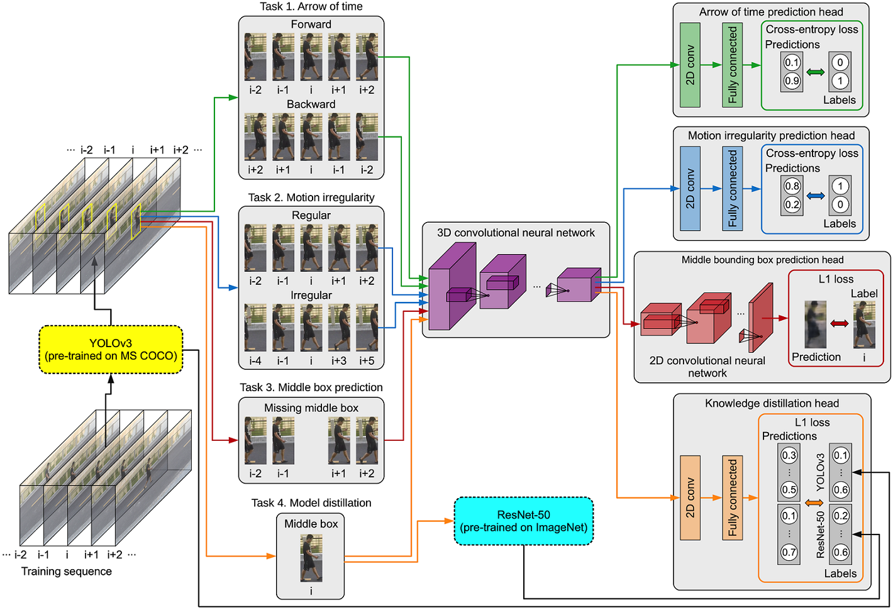

## Anomaly Detection in Video via Self-Supervised and Multi-Task Learning
Mariana-Iuliana Georgescu, Antonio Barbalau, Radu Tudor Ionescu, Fahad Shahbaz Khan, Marius Popescu, Mubarak Shah

IEEE/CVF Conference on Computer Vision and Pattern Recognition (CVPR), 2021.

Official URL: https://openaccess.thecvf.com/content/CVPR2021/html/Georgescu_Anomaly_Detection_in_Video_via_Self-Supervised_and_Multi-Task_Learning_CVPR_2021_paper.html

ArXiv URL: https://arxiv.org/pdf/2011.07491.pdf

This is the official repository of "Anomaly Detection in Video via Self-Supervised and Multi-Task Learning".

### In order to receive our code fill in this [form](./SecurifAI-form-and-license-CVPR-2021.pdf) and send a copy to georgescu_lily@yahoo.com and raducu.ionescu@gmail.com. The form must be sent from your academic email.

### License
The source code of our model is released under the SecurifAI’s NonCommercial Use & No Sharing International Public License. The details of this license are presented in SecurifAI-license-v1.0.pdf.

### Citation
Please cite our work if you use any material released in this repository.

```
@InProceedings{Georgescu_2021_CVPR,
    author    = {Georgescu, Mariana-Iuliana and Barbalau, Antonio and Ionescu, Radu Tudor and Khan, Fahad Shahbaz and Popescu, Marius and Shah, Mubarak},
    title     = {Anomaly Detection in Video via Self-Supervised and Multi-Task Learning},
    booktitle = {Proceedings of the IEEE/CVF Conference on Computer Vision and Pattern Recognition (CVPR)},
    month     = {June},
    year      = {2021},
    pages     = {12742--12752}
}
```

### This repo contains: 
 - the form that must be filled in order to obtain our source code.
 - annotated videos obtained using our abnormal event detection method.  
 
### Short Abstract 
In this paper, we approach anomalous event detection in video through self-supervised and multi-task learning at the object level.
We first utilize a pre-trained detector to detect objects. Then, we train a 3D convolutional neural network to produce discriminative 
anomaly-specific information by jointly learning multiple proxy tasks: three self-supervised and one based on knowledge distillation. 

The self-supervised tasks are: 

  (i) discrimination of forward/backward moving objects (arrow of time), 
    
  (ii) discrimination of objects in consecutive/intermittent frames (motion irregularity) 
    
  (iii) reconstruction of object-specific appearance information. The knowledge distillation task takes into account both classification and detection information, generating large prediction discrepancies between teacher and student models when anomalies occur. 

To the best of our knowledge, we are the first to approach anomalous event detection in video as a multi-task learning problem, 
integrating multiple self-supervised and knowledge distillation proxy tasks in a single architecture. 
Our lightweight architecture outperforms the state-of-the-art methods on three benchmarks: Avenue, ShanghaiTech and UCSD Ped2. 

This is the pipeline of our framework:
 


### Evaluation
With some exceptions, we note that many previous works do not mention if the frame-level AUC is computed by (i) concatenating all frames then computing
the score (micro-averaged AUC), or by (ii) computing the frame-level AUC for each video, then averaging the resulting scores (macro-averaged AUC).
Without clear guidance, in our paper, we reported the macro-averaged frame-level AUC. Here, we also report the micro-averaged frame-level AUC, RBDC and TBDC.
 

<table>
<tr>
    <td>Data set</td> 
    <td>Micro-AUC</td>
    <td>Macro-AUC</td>
    <td>RBDC</td>
    <td>TBDC</td>
</tr>

<tr>
    <td>Avenue</td> 
    <td>91.5%</td>
    <td>91.9%</td>
    <td>57.0%</td>
    <td>58.3%</td>
</tr>

<tr>
    <td>ShanghaiTech</td> 
    <td>82.4%</td>
    <td>89.3%</td>
    <td>42.8%*</td>
    <td>83.9%*</td>
</tr>

<tr>
    <td>UCSD Ped2</td> 
    <td>97.5%</td>
    <td>99.8%</td>
    <td>72.8%</td>
    <td>91.2%</td>
</tr>

</table>

The reported scores are obtained at object level.

\* The ground-truth tracklets used in the evaluation are taken from: https://github.com/lilygeorgescu/AED
